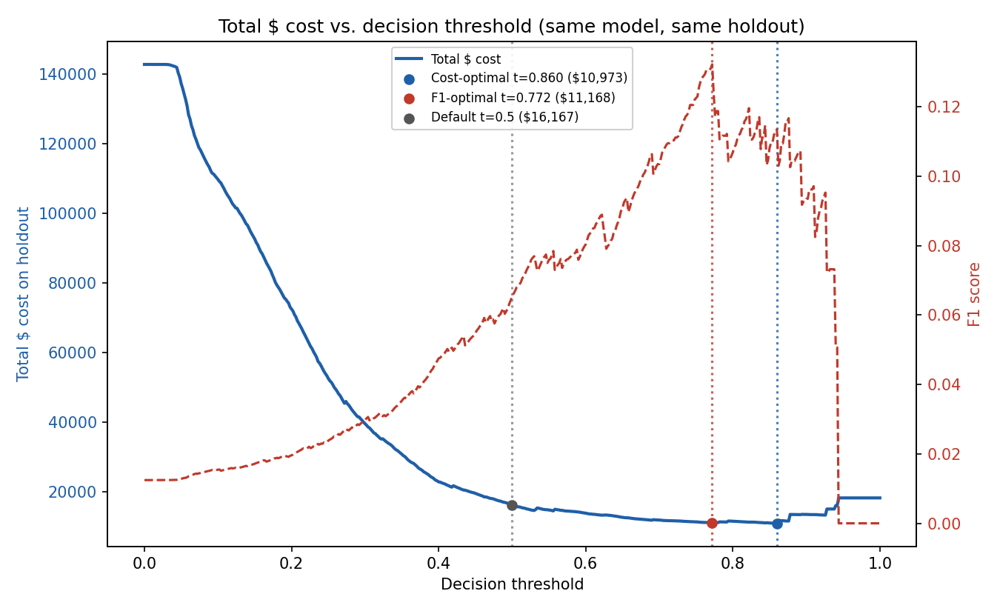
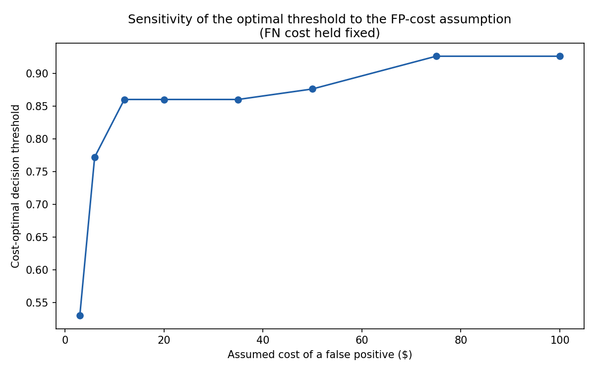

# fraud-anomaly-detector

A fraud/anomaly classifier whose decision **threshold is chosen by sweeping the
real $ cost of false positives vs. false negatives** against a trained
model's predicted probabilities -- not by optimizing F1 or accuracy, and not
by defaulting to 0.5.

> Most fraud demos train a classifier, report AUC/F1, and stop. The rare,
> differentiating move is picking the operating threshold from the actual
> dollar cost function, publishing that reasoning explicitly, and showing how
> sensitive the answer is to the (debatable) cost assumptions. That's the
> entire deliverable here.

## Status

v0.1 -- synthetic data generator, baseline classifier, explicit cost
function, threshold sweep, cost/F1/default comparison, concept-drift check,
and cost-assumption sensitivity analysis are all implemented and covered by
the real run below.

## The real numbers (from an actual run, not invented)

```
fraud-detector run --n-samples 80000 --fraud-rate 0.012 --out-dir reports
```

80,000 synthetic transactions, 1.2% fraud rate, trained on the pre-drift
regime (see [Concept drift](#concept-drift-check), split 75/25 train/holdout,
`HistGradientBoostingClassifier` with class-balanced sample weights,
`random_state=42`.

```
=== Cost assumptions ===
  FP cost:        $12.00 flat per false decline
  FN cost:        amount x 1.00 + $25.00 flat fee

=== Threshold comparison (same model, same holdout) ===
  Cost-optimal:   threshold=0.860  total_cost=$10,973.28
  F1-optimal:     threshold=0.772  total_cost=$11,167.52  f1=0.132
  Default (0.5):  threshold=0.500  total_cost=$16,166.60

  $ saved choosing cost-optimal over F1-optimal:   $194.24
  $ saved choosing cost-optimal over default 0.5:  $5,193.31
```

Same trained model, same 20,000-row holdout, three thresholds. Just moving
the cutoff from the reflexive default of 0.5 to the empirically cost-optimal
0.860 saves **$5,193.31** (32.1%) in total $ cost on this holdout. Even
against F1-optimal -- itself a smarter choice than the naive default -- the
cost-optimal threshold still saves **$194.24**, because F1 treats a missed
$800 fraud and a missed $8 fraud as the same "false negative," while the
cost function does not.



The blue curve is the actual computed $ cost at 501 thresholds swept from
0.0 to 1.0 (dashed red is F1, right axis, shown only for the comparison).
Note the F1 curve peaks at a *lower* threshold (0.772) than the cost curve's
minimum (0.860): F1 is happy to accept more false positives than the cost
function will tolerate, because F1 doesn't know a false positive costs $12
and a false negative costs $25-plus-the-transaction-amount.

## The cost function, and why it's a real dollar model, not a knob

Defined explicitly in [`src/fraud_anomaly_detector/cost.py`](src/fraud_anomaly_detector/cost.py)
as an importable `CostAssumptions` dataclass with a `reasoning` string
attached to every constant -- nothing here is a hidden magic number in a
training script.

**False Negative (a real fraud transaction we let through), default
assumption:**

```
fn_cost = amount * fn_loss_fraction (1.0)  +  fn_flat_fee_usd ($25)
```

- The merchant/issuer eats the full transaction amount as a chargeback loss
  (`fn_loss_fraction = 1.0`) -- standard for card-not-present fraud where the
  goods or funds are simply gone.
- Plus a flat `$25` per-incident fee for chargeback/dispute processing (card
  network fees + investigator time), independent of transaction size. This
  is a rough midpoint of published card-network chargeback fee ranges
  ($15-$40).

**False Positive (a legitimate transaction we block/flag), default
assumption:**

```
fp_cost = $12.00 flat
```

A blended estimate of a false decline's cost: ~$5-8 of support-agent review
time, plus an amortized estimate of customer-friction/churn risk from
wrongly blocking someone's purchase. **This is explicitly the weakest, most
debatable assumption in the model** -- a real FP cost should scale with
customer lifetime value, which is not modeled here. That's exactly why this
project doesn't report one number and call it done; see the next section.

**True positives and true negatives are assumed $0 marginal cost** -- the
transaction is handled the same operational way either way.

## Sensitivity: the FP-cost assumption is debatable, so it's swept, not fixed

Per the spec's explicit edge case ("cost assumptions are inherently
debatable -- show sensitivity across a plausible range, not just one fixed
number"), `sensitivity_analysis()` recomputes the cost-optimal threshold
across a range of plausible FP costs, holding the FN cost model fixed:

| Assumed FP cost | Cost-optimal threshold | Total $ cost |
|---:|---:|---:|
| $3   | 0.530 | $9,266.60 |
| $6   | 0.772 | $10,345.52 |
| $12  | 0.860 | $10,973.28 |
| $20  | 0.860 | $11,437.28 |
| $35  | 0.860 | $12,307.28 |
| $50  | 0.876 | $13,072.67 |
| $75  | 0.926 | $13,652.35 |
| $100 | 0.926 | $13,777.35 |



The direction is exactly what the cost logic predicts: the cheaper a false
positive is assumed to be, the more aggressively the optimal threshold
flags transactions (lower threshold, more false positives tolerated); the
more expensive, the more conservative it gets. The threshold is not
razor-sensitive to small changes in the assumption (it's flat across
$12-$35), which is itself useful evidence that the headline $12 choice isn't
a fragile cherry-pick -- but it does move meaningfully across the full
plausible range, which is why this table is published instead of a single
point estimate.

## Concept drift check

Fraud patterns are not static -- fraudsters adapt to whatever a detector was
trained on. The synthetic generator injects one deliberate regime shift at
`day_index=90` (60% through the simulated 150-day window): before it, fraud
correlates most strongly with foreign, card-present-style transactions;
after it, the same overall fraud rate shifts toward a velocity-burst pattern
(many transactions in a short window) -- a documented real-world adaptation
once foreign-transaction blocking becomes common. The model is trained
**only on pre-drift data** and then evaluated on both regimes without
retraining:

```
=== Concept drift check (model trained pre-drift only) ===
  Pre-drift-optimal threshold:  0.860
  Post-drift-optimal threshold: 0.518
  Cost of reusing stale pre-drift threshold on post-drift data: $91,495.62
  Cost of recalibrating threshold on post-drift data:           $85,635.63
  $ penalty for NOT recalibrating after drift:                  $5,859.99
```

Two things worth noting honestly: (1) the optimal threshold itself moves a
lot (0.860 -> 0.518) once the fraud pattern shifts, which is the whole point
of the edge case -- a threshold picked once and never revisited decays; (2)
the *absolute* post-drift cost is far higher than pre-drift in both rows,
because the model was never trained on the post-drift signal at all (no
retraining happens here, by design, to isolate "threshold recalibration
alone" from "full model retraining", which is a different, larger
intervention this project doesn't attempt). Recalibrating just the
threshold recovers $5,859.99 of that; it does not recover all of it -- a
production system would need to retrain periodically too.

## Architecture

```
src/fraud_anomaly_detector/
  data.py        synthetic transaction generator (documented generative
                  process + injected concept-drift regime shift)
  cost.py        CostAssumptions (explicit $ constants + reasoning),
                  evaluate_cost() (confusion matrix -> $ cost at 1 threshold)
  model.py        train_baseline() -- HistGradientBoostingClassifier with
                  class-balanced sample weights; score()
  threshold.py    sweep_thresholds() (scores once, sweeps many thresholds),
                  find_cost_optimal / find_f1_optimal / find_default_threshold,
                  sensitivity_analysis()
  db.py           SQLite persistence: predictions, threshold_sweep_results
  pipeline.py     glues the above into one run: data -> train -> sweep ->
                  compare -> drift check -> sensitivity
  reporting.py    renders the cost-vs-threshold PNG, sensitivity PNG/CSV
  cli.py          `fraud-detector run` (Typer)
```

### API / interface contract (matches the spec)

```python
train_baseline(data, feature_cols) -> TrainedModel
sweep_thresholds(model, holdout, cost_fn) -> list[ThresholdResult]
find_cost_optimal(sweep_results) -> {"threshold": ..., "total_cost": ...}
```

### Data model (matches the spec)

SQLite tables written by `fraud-detector run` to `reports/fraud.db`:

- `predictions(transaction_id, true_label, predicted_probability)`
- `threshold_sweep_results(threshold, tp, fp, tn, fn, precision, recall, f1, fp_cost_usd, fn_cost_usd, total_cost_usd)`

## Why synthetic data, not a downloaded public dataset

The spec calls for "a public fraud/anomaly dataset with realistic class
imbalance" (e.g. the well-known Kaggle `mlg-ulb/creditcardfraud` dump). This
project deliberately uses a **documented synthetic generator**
([`data.py`](src/fraud_anomaly_detector/data.py)) instead, for three
concrete reasons:

1. **No Kaggle auth / large binary CSV to reproduce the repo with.** `pip
   install -e . && fraud-detector run` is the entire reproduction path.
2. **Explicit generative process.** Every feature's relationship to the
   fraud label is a documented, readable logistic combination (see
   `data.py`'s docstring) -- nothing about "genuine fraud/normal patterns"
   is a black box or someone else's undocumented labeling process.
3. **Controlled concept drift.** A single static CSV cannot demonstrate the
   drift edge case above; the synthetic generator can inject a specific,
   labeled regime shift at a known day.

**Stated limitation (per spec Sec. 13):** the 1.2% fraud rate is chosen for
statistical stability of a 501-point threshold sweep on a laptop-sized
sample (~960 fraud rows at 80k transactions), not because it's claimed to
match real-world card fraud base rates (often far lower, ~0.1-0.5%). A lower
base rate would push every dollar figure in this README down roughly
proportionally to the fraud volume, but the *methodology* -- sweep a real
cost function instead of optimizing F1, and publish the sensitivity to the
cost assumptions -- is unaffected by the base rate, and is the actual claim
of this project. This mirrors the same caveat the spec asks to state about a
downloaded public dataset's base rate, just applied to a synthetic one.

## Install

```bash
pip install -e ".[dev]"
```

Requires Python 3.10+.

## Usage

```bash
fraud-detector run \
  --n-samples 80000 \
  --fraud-rate 0.012 \
  --fp-cost 12.0 \
  --fn-flat-fee 25.0 \
  --fn-loss-fraction 1.0 \
  --out-dir reports
```

Writes `reports/fraud.db` (SQLite predictions + sweep results),
`reports/cost_vs_threshold.png`, `reports/sensitivity.png`,
`reports/threshold_sweep.csv`, `reports/sensitivity.csv`, and prints the
cost/F1/default comparison and drift check to stdout (exactly the numbers
reproduced above). All options are overridable, including the cost
assumptions themselves -- rerun with `--fp-cost 40` to see the whole
analysis recompute under a different (equally defensible) FP-cost
assumption.

## Testing

```bash
pytest tests/ -v
```

29 tests, ~70s, all passing. Organized around the spec's testing plan:

- `test_cost.py` -- hand-computed sanity checks of the cost function at
  threshold 0.0 / 0.5 / 1.0 against manually-verified expected $ amounts,
  done **before** trusting the full sweep, per the spec's testing plan; plus
  a check that every cost assumption carries reasoning text.
- `test_data.py` -- fraud rate lands near target, generation is
  deterministic given a seed, and the injected drift regime actually
  changes the fraud pattern's feature composition.
- `test_model.py` -- the classifier clears an AUC bar meaningfully above
  chance (it has to actually learn the generator's signal, not just fit
  noise).
- `test_threshold.py` -- the sweep is deterministic/reproducible given the
  same model and holdout (spec testing plan); `predict_proba` is called
  **exactly once** per sweep (direct regression test of "same model, only
  the threshold varies"); cost-optimal and F1-optimal are verified against
  brute-force argmin/argmax.
- `test_db.py` -- SQLite round-trips for both tables in the data model.
- `test_edge_cases.py` -- the three edge cases from spec Sec. 9: zero
  predicted positives at extreme thresholds (no division by zero,
  precision/recall guarded to 0.0 not NaN), concept drift (threshold
  recalibrated post-drift beats the stale pre-drift threshold, in $), and
  FP-cost sensitivity (cheaper FP assumption -> lower optimal threshold,
  more expensive -> higher).
- `test_integration.py` -- the full pipeline end to end at a smaller,
  CI-friendly scale, including that the plots actually get written to disk.

CI (`.github/workflows/ci.yml`) runs the full suite plus a real (smaller)
`fraud-detector run` on every push, uploading the plots/CSVs as build
artifacts -- so the evidence in this README is continuously reproduced, not
a one-time screenshot.

## What's implemented vs. deliberately deferred

**Implemented:** synthetic data generator with a documented, non-trivial,
noisy generative process and an injected concept-drift regime; baseline
gradient-boosting classifier with class-imbalance handling; explicit,
reasoned $ cost function; full threshold sweep with cost-optimal /
F1-optimal / default comparison on the same model; sensitivity analysis
across a plausible FP-cost range; a concept-drift check quantifying the $
penalty of a stale threshold; SQLite persistence matching the spec's data
model; a CLI that reproduces every number in this README; CI that re-runs
the whole thing on every push.

**Deliberately deferred / scope cuts** (this is a rigorous analysis and
write-up, per the spec's own non-goals, not a production service):

- **No downloaded public dataset.** Used a documented synthetic generator
  instead, for the reasons stated above. This is the single largest
  deviation from the spec's Architecture section ("a public fraud/anomaly
  dataset") and is called out explicitly rather than left implicit.
- **No SMOTE / imbalanced-learn dependency.** Class imbalance is handled via
  sample-weighting at training time (`compute_sample_weight`), which was
  sufficient once the actual decision boundary is set by the swept
  threshold rather than the raw 0.5 cutoff. Considered, not required.
- **No hyperparameter tuning / model selection.** One
  `HistGradientBoostingClassifier` configuration is used throughout; the
  project's claim is about threshold selection given a fixed trained model,
  not about maximizing raw classifier quality.
- **No production serving path** (batch scoring API, drift *monitoring* in
  production, automatic retraining trigger) -- explicitly out of scope per
  the spec's non-goals ("not building a production fraud-detection
  service").
- **Concept-drift handling is a threshold-recalibration check, not
  automatic retraining.** The pipeline demonstrates that the optimal
  threshold shifts and quantifies the $ cost of not noticing, but does not
  implement a drift *detector* or auto-retraining loop -- that's a
  meaningfully larger project (see the sibling `drift-detector` project in
  this portfolio for a dedicated treatment of that problem).

## Environment

- Python 3.10+
- scikit-learn (`HistGradientBoostingClassifier`), numpy, pandas, matplotlib
- SQLite (bundled with Python) for persistence -- no server to stand up
- Typer for the CLI

## License

MIT -- see [LICENSE](LICENSE).
